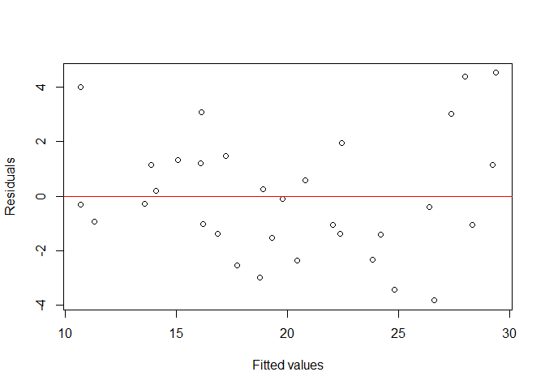
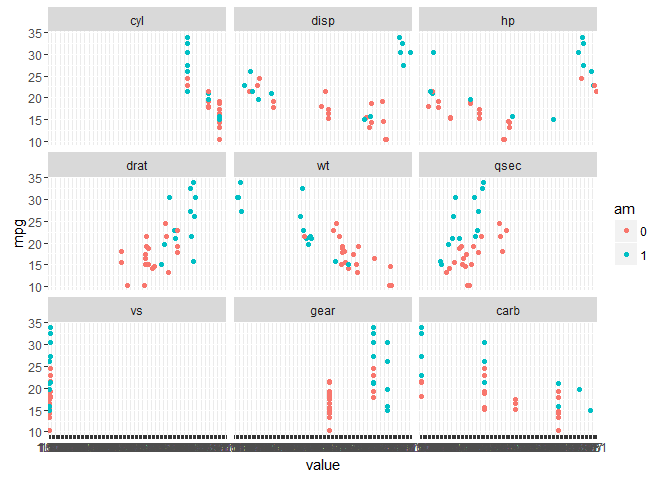

Summary
=======

The goal of this study is to check whether automatic transmission has an
impact on MPG in cars. We have a dataset of 32 cars with 11 measurement
from each such as MPG, weight, displacement etc. We use regression
analysis to check for the impact of transmission type on fuel
consumption.

At the end we will see that, although it seems at the first look that
automatic transmission decreases MPG but this is not an statistically
meaningful conclusion.

Data Explanation
================

The data was extracted from the 1974 Motor Trend US magazine, and
includes fuel consumotion (mpg), Number of cylinders(cyl), Displacement
(disp), Gross horsepower(hp), Rear axle ratio (drat), Weight (wt), 1/4
mile time (qsec), V/S (vs), Transmission (am, 0 = automatic, 1 =
manual), Number of forward gears (gear), Number of carburetorsof (carb),
for 32 automobiles (1973-74 models).

Comparing the MPG of automatic transmissited cars vs manaully
transsmitted ones (17.1473684, 24.3923077) make us thick that automatic
transsmission has a negaive imoact on fuel ecomomy. Bit let's take a
look at MPG vs other variables

Let's look at the rough relation between transmission type and fuel
economy.

In particular in case of weight(wt) and rear axle ratio (drat)
variables, one can see that they both have impact on MPG and on the
other hand, they can roughly separate automatic and manually transmitted
cars. In other words more weight means less mpg also cars with automatic
transmission are heavier in this data set. So we use multivariable
regression analysis to face this lack of data in the dataset.

Regression analysis
===================

For start we fit a linear model for mpg vs are other variables and look
at the coefficients of the model.

    ## (Intercept)         cyl        disp          hp        drat          wt 
    ##       12.30       -0.11        0.01       -0.02        0.79       -3.72 
    ##        qsec         vs1         am1        gear        carb 
    ##        0.82        0.32        2.52        0.66       -0.20

It says that keeping other factors constant, the change from automatic
transsmition to manuall increases mpg by 2.52 miles per gallon. But the
confidence interval for this qoefiicent is (-1.76, 6.8) containg 0 which
means that this improvement is not statisically significant. But there
might be extra variables in the model which introduce extra variance. To
seek for that we use the varible importance factor (VIF). These are the
VIF for the model.

    ##   cyl  disp    hp  drat    wt  qsec    vs    am  gear  carb 
    ## 15.37 21.62  9.83  3.37 15.16  7.53  4.97  4.65  5.36  7.91

disp has the most vif i.e. its impact on the model if 21.62 times more
as if it was diagonal to other variables. Now we omit this variable and
fit a new model.

    ## (Intercept)         cyl          hp        drat          wt        qsec 
    ##       12.55        0.10       -0.01        0.93       -2.63        0.67 
    ##         vs1         am1        gear        carb 
    ##        0.16        2.48        0.74       -0.62

The amt coefficient is not that much changed and it is still
insignificant with 95% confidence interval of (−1.74, 6.7). Let us take
a look at the VIF's of the new model.

    ##   cyl    hp  drat    wt  qsec    vs    am  gear  carb 
    ## 14.28  7.12  3.33  6.19  6.91  4.92  4.65  5.32  4.31

cyl has still too high VIF. This time we ommit that.

    ## (Intercept)          hp        drat          wt        qsec         vs1 
    ##       13.81       -0.01        0.89       -2.61        0.64        0.09 
    ##         am1        gear        carb 
    ##        2.42        0.69       -0.61

Again a small decrease in the am coefficient and still non-significant
(confidence interbal: −1.53, 6.38). What about VIF'f of this thord
model.

    ##   hp drat   wt qsec   vs   am gear carb 
    ## 6.02 3.11 6.05 5.92 4.27 4.29 4.69 4.29

The VIF's of this last model are in a quite similar range. So there is
no sense in ommiting any of them. Now for assurance we comare the first
and last models with anova function.

    ## Analysis of Variance Table
    ## 
    ## Model 1: mpg ~ hp + drat + wt + qsec + vs + am + gear + carb
    ## Model 2: mpg ~ cyl + disp + hp + drat + wt + qsec + vs + am + gear + carb
    ##   Res.Df    RSS Df Sum of Sq      F Pr(>F)
    ## 1     23 151.47                           
    ## 2     21 147.49  2    3.9808 0.2834 0.7561

The P-value is quite high, so ommiting these two varaibales was not
actually necessary.

To get sure abput the validity of the last model I plot the residual
plot.

<!-- -->
As you can see there is no special trend in the residual plot. So the
model appears to be valid.

Conclution
==========

Although a manually transmitted car seems to show better fuel economy,
this improvement does not appear to be significant. It should be noted
that this analysis is done on an old and small dataset, so is not that
realiable. For assurance more investigation needs to be done.
<!-- -->
