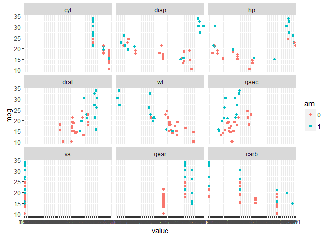

Summary
=======

The goal of this study is to check whether automatic transmission has an
impact on MPG in cars. We have a dataset of 32 cars with 11 measurement
from each such as MPG, weight, displacement etc. We use regression
analysis to check for the impact of transmission type on fuel
consumption.

At the end we will see that, although it seems at the first look that
automatic transmission decreases MPG but this is not an statistically
meaningful conclusion.

Data Explanation
================

The data was extracted from the 1974 Motor Trend US magazine, and
includes fuel consumotion (mpg), Number of cylinders(cyl), Displacement
(disp), Gross horsepower(hp), Rear axle ratio (drat), Weight (wt), 1/4
mile time (qsec), V/S (vs), Transmission (am, 0 = automatic, 1 =
manual), Number of forward gears (gear), Number of carburetorsof (carb),
for 32 automobiles (1973-74 models).

Comparing the MPG of automatic transmissited cars vs manaully
transsmitted ones (17.1473684, 24.3923077) make us thick that automatic
transsmission has a negaive imoact on fuel ecomomy. Bit let's take a
look at MPG vs other variables

Let's look at the rough relation between transmission type and fuel
economy.

<!-- -->

In particular in case of weight(wt) and rear axle ratio (drat)
variables, one can see that they both have impact on MPG and on the
other hand, they can roughly separate automatic and manually transmitted
cars. In other words more weight means less mpg also cars with automatic
transmission are heavier in this data set. So we use multivariable
regression analysis to face this lack of data in the dataset.

Regression analysis
===================

We have 10 variables to include in the regression model. But clearly
some of them are higky correlated which make unvanted variance in the
model (for instance number of cylinders and horse power). I computed the
corrolation between varoable and ommited those which are more than 80%
corrolated. Which ommit mpg, cyl variables and leave me with disp, hp,
drat, wt, qsec, vs, am, gear, carb.
